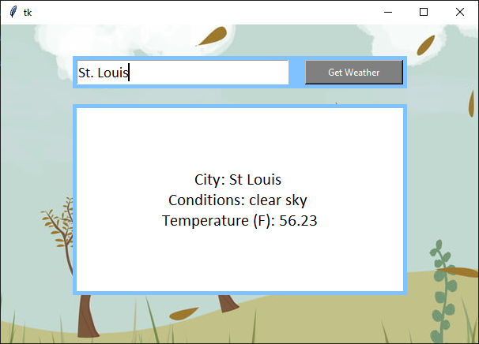

# Weather App

This Python application fetches and displays current weather information for a specified city using the OpenWeather API. The graphical user interface (GUI) is built with Tkinter. The repository also includes a PyInstaller `.spec` file for packaging the application into an executable.

---

## Features
- Fetches real-time weather data from the OpenWeather API.
- Displays city name, weather conditions, and temperature in Fahrenheit.
- Simple and intuitive GUI with a text entry field and a "Get Weather" button.
- Option to package the application as a standalone executable using PyInstaller.

---

## Requirements
- Python 3.x
- Libraries:
  - `requests` (for API calls)
  - `tkinter` (built-in with Python for GUI)
- [PyInstaller](https://pyinstaller.org/) for building the executable.
- An API key from [OpenWeather](https://openweathermap.org/api).

---

## How to Use
### Running the Python Application
1. Clone this repository to your local machine.
   ```bash
   git clone <your-repository-url>
   cd <repository-folder>
   ```
2. Install required dependencies:
   ```bash
   pip install requests
   ```
3. Replace `<API KEY FOR OPENWEATHER HERE>` in the `weather_app.py` file with your OpenWeather API key.

**If you just created your API Key, you may get errors until a couple hours after it being verified via email**

6. Run the application:
   ```bash
   python weather_app.py
   ```
7. Enter the name of the city in the text box and press the **Return** key or click the "Get Weather" button.

### Creating an Executable
1. Install PyInstaller if not already installed:
  ```bash
  pip install pyinstaller
  ```
2. Use the provided `weather_app.spec` file to build the executable:
  ```bash
  pyinstaller weather_app.spec
  ```
3. The executable will be created in the `dist` folder

---

## File Structure
```bash
.
├── weather_app.py        # Main script for the weather application
├── weather_app.spec      # PyInstaller specification file for creating an executable
├── background_image.png  # Background image for the GUI (ensure this file exists)
├── app_screenshot.png    # screenshot example of how the app should behave
```
---

## File Details
### `weather_app.py`
The main application script containing:
* **GUI Setup:** Configures the Tkinter-based interface.
* **API Integration:** Fetches weather data from OpenWeather.
* **Error Handling:** Displays a user-friendly message in case of failures.

### `weather_app.spec`
A PyInstaller specification file used to package the application into a standalone executable. Key parameters:
* **Analysis:** Includes weather_app.py as the main script.
* **Path:** Sets the working directory path for the application.
* **EXE Settings:**
  * `name`: The output executable is named `weather_app`.
  * `console`: Enabled for debugging output (can be set to `False` to supress the console window).

---

## Example Screenshot


---

## Future Enhancements:
- **Multi-Unit Support**: Add support for temperature in Celsius and Kelvin.
- **Improved Error Handling**: Provide more detailed and user-friendly error messages.
- **Enhanced GUI**: Update the design with better styling and weather icons.
- **Advanced Search Options**: Allow searching by geographic coordinates or postal codes.
- **Cross-Platform Packaging**: Extend executable packaging to support macOS and Linux.
